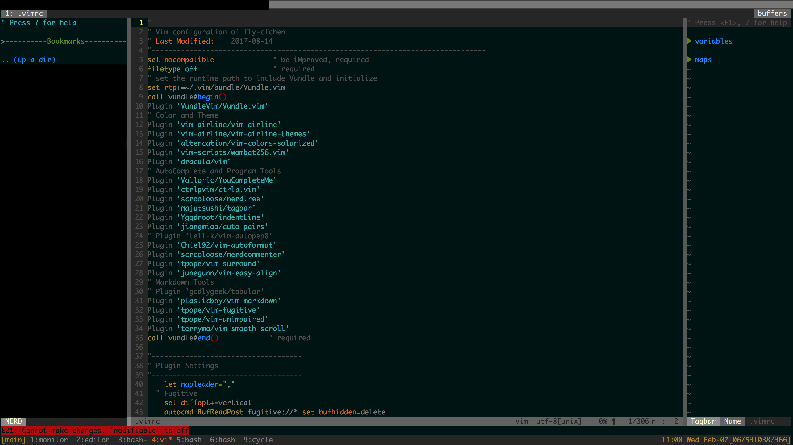

# Vim and Tmux configuration
 - [Vim Config](#vim-config)
   * [Update to Vim 8](#update-to-vim-8)
   * [Plugin Notes](#plugin-notes)
 - [Tmux Config](#tmux-config)
 - [How to cooperate vim and tmux](#how-to-cooperate-vim-and-tmux)
 - [SecureCRT configuration](#securecrt-configuration)


## Vim Config
My vimrc and some candidates
- [`.vimrc`](.vimrc)
- https://github.com/samlaudev/ConfigurationFiles
- https://github.com/GoYchen/VIM_TMUX
- https://github.com/PytLab/dotfiles
- Reference: http://www.jianshu.com/p/f0513d18742a

[**HERE**](http://learnvimscriptthehardway.stevelosh.com/chapters/01.html) is a perfect book for you to learn vim scripts.

### Update to Vim 8
Check Vim version by `:ve(rsion)` in Vim. Vim 8 supports some convenient plugin. Update to vim 8 with the following lines.
```
sudo add-apt-repository ppa:jonathonf/vim        # get the newest version of vim
sudo apt-get update && sudo apt-get install vim  # update package
```
To work with python 3
```
sudo apt-get install vim-nox                  # add python3 support
```
To work with python 2
```
sudo apt install vim-nox-py2
sudo update-alternatives --set vim /usr/bin/vim.nox-py2
sudo update-alternatives --set vi /usr/bin/vim.nox-py2
```
### Plugin Notes
Plugin List

Name                             | Function
----                             | ---
'vim-airline/vim-airline'        | Status bar
'vim-airline/vim-airline-themes' | Airline Themes
'Valloric/YouCompleteMe'         | Autocomplete
'ctrlpvim/ctrlp.vim'             | File Search
'scrooloose/nerdtree'            | File Tree
'majutsushi/tagbar'              | Function and Variable Tag Bar
'Yggdroot/indentLine'            | show indent
'jiangmiao/auto-pair'            | Auto pair ({["
'tpope/vim-surround'             | Add, delete, change delimiters
'tell-k/vim-autopep8'            | F8 Auto format python file
'tell-k/vim-autoflake'           | F9 Remove unused imports and variable in python file 
'scrooloose/nerdcommenter'       | F5 Quick comment
'tpope/vim-fugitive'             | Git wrapper in vim
'terryma/vim-smooth-scroll'      | Smooth scroll
'junegunn/vim-easy-align'        | Align codes easily
'tpope/vim-unimpaired'           | Easy :next and :previous
'plasticboy/vim-markdown'        | Markdown

Get `Vundle` first by
```
git clone https://github.com/VundleVim/Vundle.vim.git ~/.vim/bundle/Vundle.vim
```
Then install these Plugins by `:PluginInstall` in Vim.

#### YouCompleteMe
Ultimate auto-complete plugin for Vim. After installation, you need to compile it
```
cd ~/.vim/bundle/YouCompleteMe
./install.py --clang-completer
```

#### Extra Dependencies of Plugins 
- `tagbar` F4, displays tags in a window
- `autopep8` F8, automatically formats Python code to conform to the PEP 8 style guide. **(Not work very well)**
- `autoflake` F9, automatically remove unused imports and variables in current python file.   

To make them work, you should install the following packages:
```
conda install -c conda-forge ctags
pip install autopep8
pip install autoflake
```

#### Other Custom Settings
*Normal Mode*
- map `<Space>` as `<leader>`
- F3 or `<leader>+m`, NerdTree; F4 or `<leader>+t`, Tagbar; F6, NerdTree and Tagbar
- F2, write and exit; `<leader>`+w, write; `<leader>+q`, exit

*Insert Mode*
- Ctrl+l, ESC

## Tmux Config

My tmux configuration is in [`.tmux.conf`](.tmux.conf)  
Main features are
- Rebind `Ctrl+b` to `Ctrl+x`
- Enable mouse to select window and panel, resize panel
- Enlarge history to 10000 lines
- Horizontal split: `bind-key -`, Vertical split: `bind-key ]`
- Date and Time on status bar.

## How to cooperate vim and tmux 
For unknow reason, vim colortheme may not work in tmux without the following configuration  
(1) In .vimrc
```
se t_Co=256
set term=screen-256color
```
(2) In .bashrc
```
 alias tmux="TERM=screen-256color tmux" 
```
Note: please use `source ~/.bashrc` to make it effective.

## SecureCRT configuration
Remember keys in Mac. If you want to remember ssh keys in mac, you must turn off the key chains in `Preferences -> General -> Mac options`
### Color 
1. Change the theme to White/Black in `Preferences -> General -> Default Session -> Edit Default Settings -> Appearance`
1. You can also config the ANSI color under the `Appearance`, details see [this blog](http://liam0205.me/2015/09/24/color-scheme-for-securecrt/index.html)
### Session Setting
1. Hide tool bar, `Preferences -> General -> view`
1. Show path in tab, `Preferences -> General -> Default Session -> Edit Default Settings -> Terminal -> Emulation`.  
Change terminal to `Xterm`, tick `ANSI color`. Change to a bigger `Scroll back buffer` if you want. (Reference [blog](http://blog.csdn.net/delphiwcdj/article/details/7226921)) 
1. Enable `Fn` keys in Mac. Change terminal to `Xterm`.
### References
1. [SecureCRT实用配置](http://xstarcd.github.io/wiki/windows/SecureCRT_confs.html)
